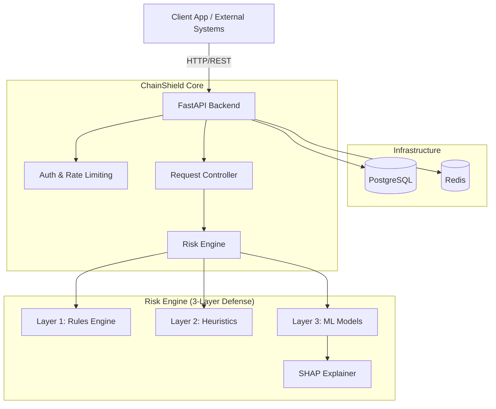

# ChainShield System Documentation

## 🛡️ System Overview

**ChainShield** is an enterprise-grade, AI-powered cryptocurrency security and transaction intelligence platform. It provides real-time risk assessment for wallets and transactions using a sophisticated **3-Layer Defense Engine** that combines deterministic rules, heuristic analysis, and advanced machine learning models.

The system is designed to detect malicious activities, money laundering patterns, and high-risk interactions in the blockchain ecosystem, providing explainable AI (XAI) insights to compliance teams and automated systems.

---

## 🏗️ System Architecture

ChainShield follows a microservices-ready architecture containerized with Docker.

### High-Level Architecture



### Core Components

1.  **Backend API (FastAPI)**:
    *   High-performance, async Python web server.
    *   Handles authentication, rate limiting, and request routing.
    *   Auto-generated OpenAPI (Swagger) documentation.

2.  **Risk Engine**:
    *   The heart of ChainShield.
    *   **Layer 1: Rules Engine** - Deterministic checks (e.g., sanctioned lists, blacklists).
    *   **Layer 2: Heuristics** - Pattern recognition (e.g., structuring, rapid movement).
    *   **Layer 3: Machine Learning** - trained ensemble models (RandomForest, XGBoost) to detect subtle anomalies.
    *   **Graph Analysis**: Analyzes transaction networks for localized clustering and risk propagation.

3.  **Data Persistence**:
    *   **PostgreSQL**: Primary data store for users, analysis history, wallet profiles, and system configuration.
    *   **Redis**: High-speed caching for risk scores, rate limiting counters, and session management.

---

## 🚀 Key Features

### 🔍 Real-Time Risk Assessment
- **Wallet Profiling**: Instant risk scoring (0-100) based on on-chain history and behavior.
- **Transaction Monitoring**: Real-time evaluation of pending or confirmed transactions.
- **Batch Analysis**: Capable of processing high-volume requests for exchanges and protocols.

### 🧠 3-Layer Defense Mechanism
1.  **Static Rules**: Immediate blocking of known bad actors (OFAC, hacks).
2.  **Behavioral Heuristics**: Detection of suspicious patterns like "peeling chains" or "mixer usage".
3.  **ML Anomaly Detection**: Statistical models trained on 475k+ labelled transactions.

### 🤖 Explainable AI (XAI)
- Every risk score comes with a **Feature Contribution Breakdown**.
- Uses **SHAP (SHapley Additive exPlanations)** to tell you *exactly* why a wallet was flagged (e.g., "High interaction with mixer: +45 risk").

### 📊 Dashboard & Monitoring (Frontend)
- Visualization of risk trends.
- Transaction graph exploration.
- Alert management and manual review workflows.

---

## 🛠️ Technology Stack

| Component | Technology | Description |
|-----------|------------|-------------|
| **Language** | Python 3.11+ | Type-hinted codebase |
| **Framework** | FastAPI | Async web framework |
| **Database** | PostgreSQL 16 | Relational data & vector storage |
| **Cache** | Redis 7 | Caching & Rate Limiting |
| **ORM** | SQLAlchemy 2.0 | Async database interaction |
| **ML/AI** | Scikit-Learn, XGBoost | Risk models & Training |
| **Blockchain** | Web3.py | EVM Chain interaction |
| **Container** | Docker & Compose | Orchestration |
| **Testing** | Pytest | Comprehensive test suite |

---

## 📂 Project Structure

```text
chainshield/
├── backend/
│   ├── app/
│   │   ├── api/            # API Route definitions (v1)
│   │   ├── core/           # Config, Database, Security, Logging
│   │   ├── models/         # SQLAlchemy Database Models
│   │   ├── schemas/        # Pydantic Data Schemas (Request/Response)
│   │   ├── services/       # Business Logic
│   │   │   ├── risk/       # THE RISK ENGINE
│   │   │   │   ├── rules/       # Layer 1
│   │   │   │   ├── heuristics/  # Layer 2
│   │   │   │   ├── ml/          # Layer 3
│   │   │   │   └── graph/       # Graph Algorithms
│   │   │   └── blockchain/ # Chain Connectors
│   │   └── main.py         # Application Entry Point
│   ├── alembic/            # Database Migrations
│   ├── tests/              # Test Suite
│   └── requirements.txt    # Python Dependencies
├── frontend/               # Frontend Application
└── docker-compose.yml      # Local Dev Orchestration
```

---

## 🚦 Getting Started

### Prerequisites
- Docker & Docker Compose
- Python 3.11+ (for local dev)
- Node.js 18+ (for frontend)

### Quick Start (Docker)

1.  **Clone the repository**:
    ```bash
    git clone https://github.com/your-org/chainshield.git
    cd chainshield
    ```

2.  **Configure Environment**:
    ```bash
    cp .env.example .env
    # Edit .env and set your API keys (Alchemy/Infura) and Secrets
    ```

3.  **Launch System**:
    ```bash
    docker-compose up -d --build
    ```

4.  **Access Services**:
    - **API Documentation**: [http://localhost:8000/api/v1/docs](http://localhost:8000/api/v1/docs)
    - **Health Check**: [http://localhost:8000/health](http://localhost:8000/health)

### Local Development (Backend)

1.  **Setup Virtual Environment**:
    ```bash
    cd backend
    python -m venv venv
    source venv/bin/activate  # or venv\Scripts\activate on Windows
    pip install -r requirements.txt
    ```

2.  **Start Dependencies (DB/Redis)**:
    ```bash
    # From project root
    docker-compose up -d postgres redis
    ```

3.  **Run Migrations**:
    ```bash
    alembic upgrade head
    ```

4.  **Start Server**:
    ```bash
    uvicorn app.main:app --reload
    ```

---

## 🔧 Configuration

The system is configured via environment variables. Key variables include:

- `APP_ENV`: `development`, `staging`, `production`
- `DATABASE_URL`: Connection string for PostgreSQL
- `REDIS_URL`: Connection string for Redis
- `JWT_SECRET_KEY`: For auth token signing
- `RISK_HIGH_THRESHOLD`: Score above which to flag high risk (default: 70)
- `FEATURE_AI_EXPLANATIONS`: Enable/Disable heavy ML explainability tasks

See `.env.example` for the full list.

---

## 🧪 Testing

Run the test suite to ensure system integrity:

```bash
cd backend
pytest -v
```

Include coverage report:
```bash
pytest --cov=app --cov-report=term-missing
```

---

## 📜 License

This project is licensed under the MIT License - see the LICENSE file for details.
